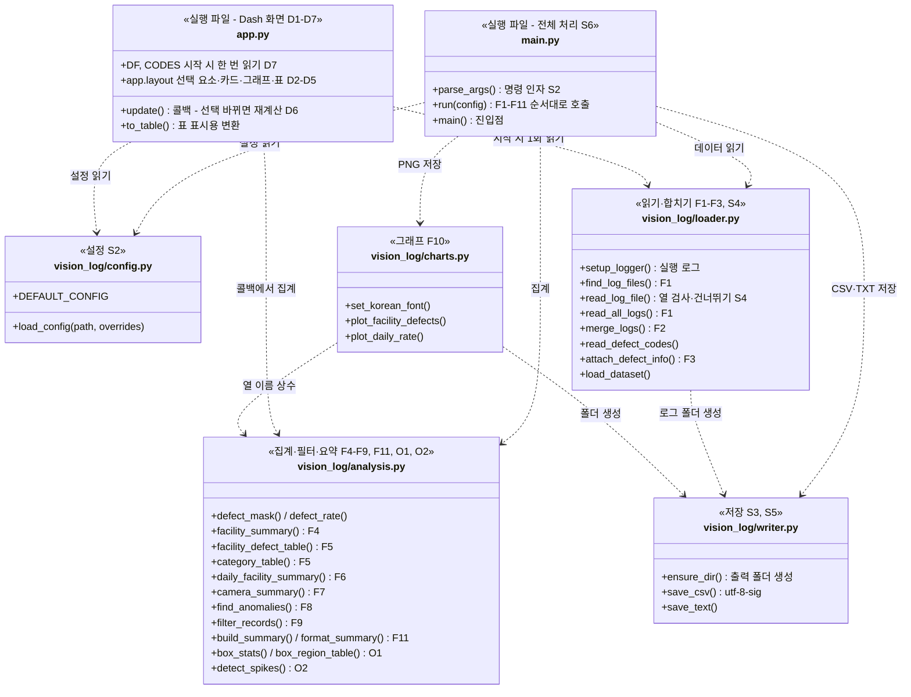
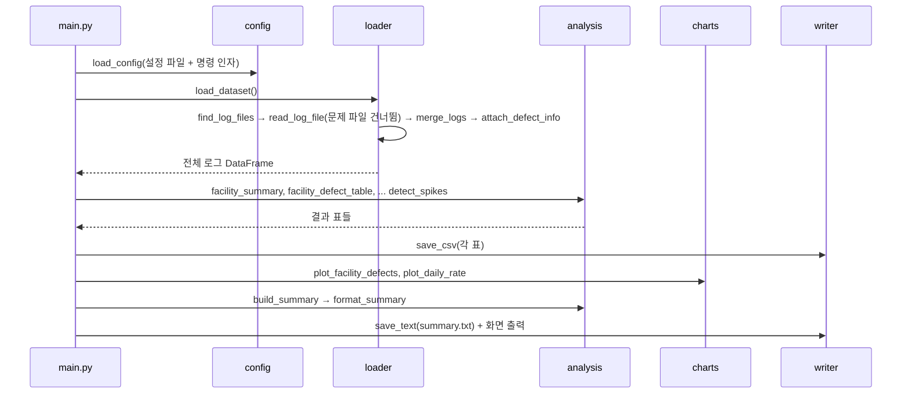

# 프로그램 구조 (UML)

파이썬 파일(모듈) 하나를 클래스 상자 하나로 표현했습니다. 상자 위의 `<< >>`는 그 파일의 역할이고,
안쪽은 그 파일의 주요 함수와 담당 요구사항 번호입니다. 점선 화살표는 "이 파일이 저 파일의 함수를 부른다"는 뜻입니다.

```mermaid
classDiagram
  direction TB

  class main["main.py"] {
    <<실행 파일 - 전체 처리 S6>>
    +parse_args() 명령 인자 S2
    +run(config) F1-F11 순서대로 호출
    +main() 진입점
  }

  class app["app.py"] {
    <<실행 파일 - Dash 화면 D1-D7>>
    +DF, CODES 시작 시 한 번 읽기 D7
    +app.layout 선택 요소·카드·그래프·표 D2-D5
    +update() 콜백 - 선택 바뀌면 재계산 D6
    +to_table() 표 표시용 변환
  }

  class config["vision_log/config.py"] {
    <<설정 S2>>
    +DEFAULT_CONFIG
    +load_config(path, overrides)
  }

  class loader["vision_log/loader.py"] {
    <<읽기·합치기 F1-F3, S4>>
    +setup_logger() 실행 로그
    +find_log_files() F1
    +read_log_file() 열 검사·건너뛰기 S4
    +read_all_logs() F1
    +merge_logs() F2
    +read_defect_codes()
    +attach_defect_info() F3
    +load_dataset()
  }

  class analysis["vision_log/analysis.py"] {
    <<집계·필터·요약 F4-F9, F11, O1, O2>>
    +defect_mask() / defect_rate()
    +facility_summary() F4
    +facility_defect_table() F5
    +category_table() F5
    +daily_facility_summary() F6
    +camera_summary() F7
    +find_anomalies() F8
    +filter_records() F9
    +build_summary() / format_summary() F11
    +box_stats() / box_region_table() O1
    +detect_spikes() O2
  }

  class charts["vision_log/charts.py"] {
    <<그래프 F10>>
    +set_korean_font()
    +plot_facility_defects()
    +plot_daily_rate()
  }

  class writer["vision_log/writer.py"] {
    <<저장 S3, S5>>
    +ensure_dir() 출력 폴더 생성
    +save_csv() utf-8-sig
    +save_text()
  }

  main ..> config : 설정 읽기
  main ..> loader : 데이터 읽기
  main ..> analysis : 집계
  main ..> charts : PNG 저장
  main ..> writer : CSV·TXT 저장
  app ..> config : 설정 읽기
  app ..> loader : 시작 시 1회 읽기
  app ..> analysis : 콜백에서 집계
  loader ..> writer : 로그 폴더 생성
  charts ..> analysis : 열 이름 상수
  charts ..> writer : 폴더 생성
```

## 실행 흐름

`python main.py`를 실행했을 때의 순서입니다.

```mermaid
sequenceDiagram
  participant M as main.py
  participant C as config
  participant L as loader
  participant A as analysis
  participant G as charts
  participant W as writer

  M->>C: load_config(설정 파일 + 명령 인자)
  M->>L: load_dataset()
  L->>L: find_log_files → read_log_file(문제 파일 건너뜀) → merge_logs → attach_defect_info
  L-->>M: 전체 로그 DataFrame
  M->>A: facility_summary, facility_defect_table, ... detect_spikes
  A-->>M: 결과 표들
  M->>W: save_csv(각 표)
  M->>G: plot_facility_defects, plot_daily_rate
  M->>A: build_summary → format_summary
  M->>W: save_text(summary.txt) + 화면 출력
```
